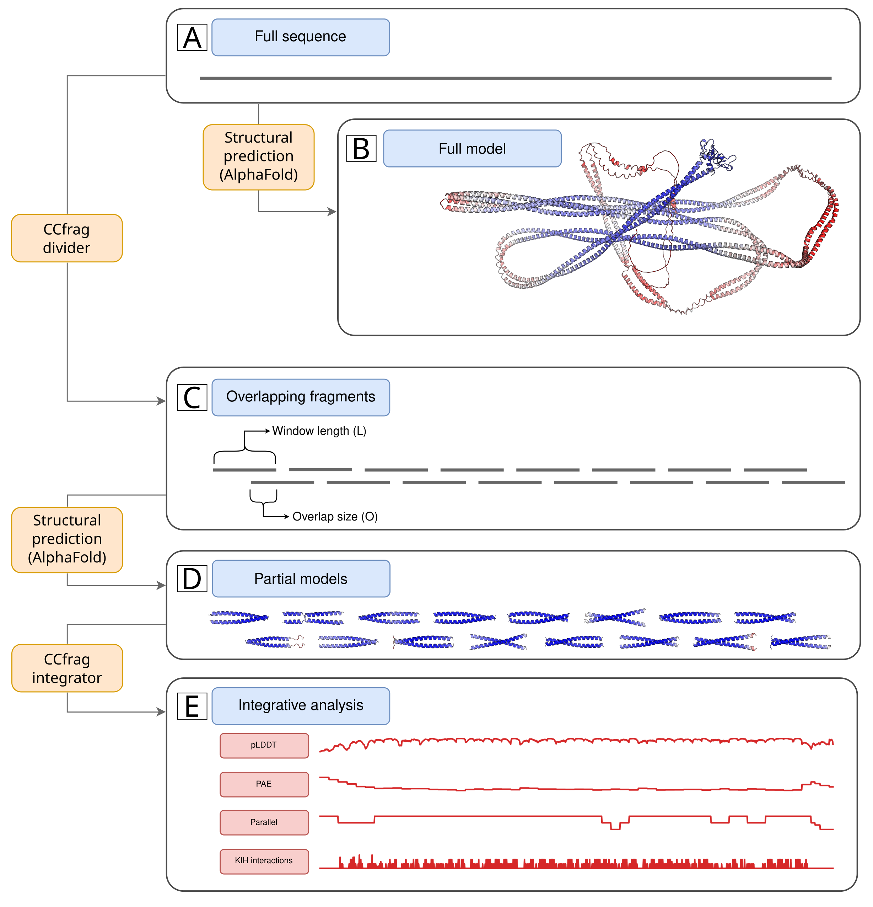
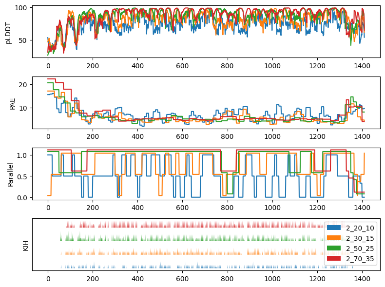
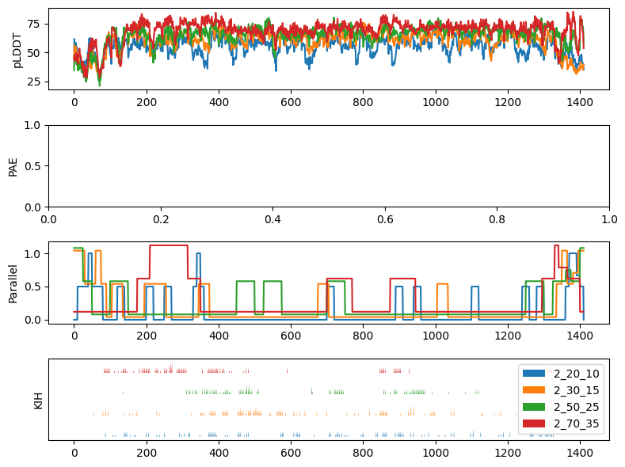

# CCfrag: Scanning folding potential of coiled-coil fragments with AlphaFold

## Summary

**Motivation**: Coiled coils are a widespread structural motif consisting of multiple α-helices that wind around a central axis to bury their hydrophobic core. Although their backbone can be uniquely described by the Crick parametric equations, these have little practical application in structural prediction, given that most coiled coils in nature feature non-canonical repeats that locally distort their geometry. While AlphaFold has emerged as an effective coiled-coil modeling tool, capable of accurately predicting changes in periodicity and core geometry along coiled-coil stalks, it is not without limitations. These include the generation of spuriously bent models and the inability to effectively model globally non-canonical coiled coils. In an effort to overcome these limitations, we investigated whether dividing full-length sequences into fragments would result in better models.

**Results**: We developed CCfrag to leverage AlphaFold for the piece-wise modeling of coiled coils. The user can create a specification, defined by window size, length of overlap, and oligomerization state, and the program produces the files necessary to run structural predictions with AlphaFold. Then, the structural models and their scores are integrated into a rich per-residue representation defined by sequence- or structure-based features, which can be visualized or employed for further analysis. Our results suggest that removing coiled-coil sequences from their native context can in some case improve the prediction confidence and avoids bent models with spurious contacts. In this paper, we present various use cases of CCfrag, and propose that fragment-based prediction is useful for understanding the properties of long, fibrous coiled coils, by showing local features not seen in full-length models.



## Installation

### Dependencies

These programs are necessary for the coiled-coil interaction analysis

* DSSP (v4)
* [Socket](http://coiledcoils.chm.bris.ac.uk/socket/)

CCfrag utilizes core functionalities from several widely-used modules, which are expected to remain stable across various versions. Should you encounter any issues, please feel free to reach out to me. Kindly include the error message and version details for the following packages:

* BioPython
* PandasPdb
* Matplotlib
* Pandas
* Numpy


### Cloning the repository

Downloading the `CCfrag` folder and its files is enough. The location is not
important, but it should be taken into account when importing the module.

A convenient way of downloading the project is with a `git` command

```bash
git clone https://github.com/Mikel-MG/CCfrag ~/myfolder
```

## Examples

As shown in the figure at the **Summary** section, AlphaFold can struggle, among
other things, when making models of long coiled coils. These models can show
unfolded regions, or areas with very poor prediction confidence (plDDT). These
problems can be aleviated via piece-wise modeling. For example, here is the
CCfrag representation of EEA1 (shown above in all of its misfolded glory).

### prediction with AlphaFold (technically, ColabFold)



### prediction with ESMfold




For details regarding the interpretation of these plots, check our manuscript^1!

In the [examples](https://github.com/Mikel-MG/CCfrag/tree/main/examples) section
you can find Jupyter notebooks that illustrate how to use this program, together
with the use-cases shown in our manuscript (see below). These examples focus on
showing that a piece-wise modeling approach can be used for:

* Scanning long coiled coils

* Improving prediction confidence

* Probing oligomerization landscape

## Parameters

For the divider module:

```
L: Length of window size

O: Length of overlap between windows (L takes priority in the last fragment)

nmer: Number of polypeptide chains

flank: Sequence to be added N- and C- terminally

tag: String to be attached to the specification name
```


For the integrator:

```
list_features: List of features to be computed for the predicted models. The list of features implemented is [plddt, para (parallel/antiparallel), kih(knobs-into-holes interactions with Socket), pae(pairwise alignment error), heli(helical/not with DSSP)]

prediction_format: Colabfold / esmfold (default: colabfold)

model_subfolder: Path inside each specification folder where the predictions are
stored (default: predictions)

dict_feature_flattening: A dictionary indicating which function to use to
flatten features in overlapping models (default: np.mean)
```


## References

1. Mikel Martinez-Goikoetxea, CCfrag: scanning folding potential of coiled-coil fragments with AlphaFold, Bioinformatics Advances, Volume 5, Issue 1, 2025, vbae195, https://doi.org/10.1093/bioadv/vbae195 
