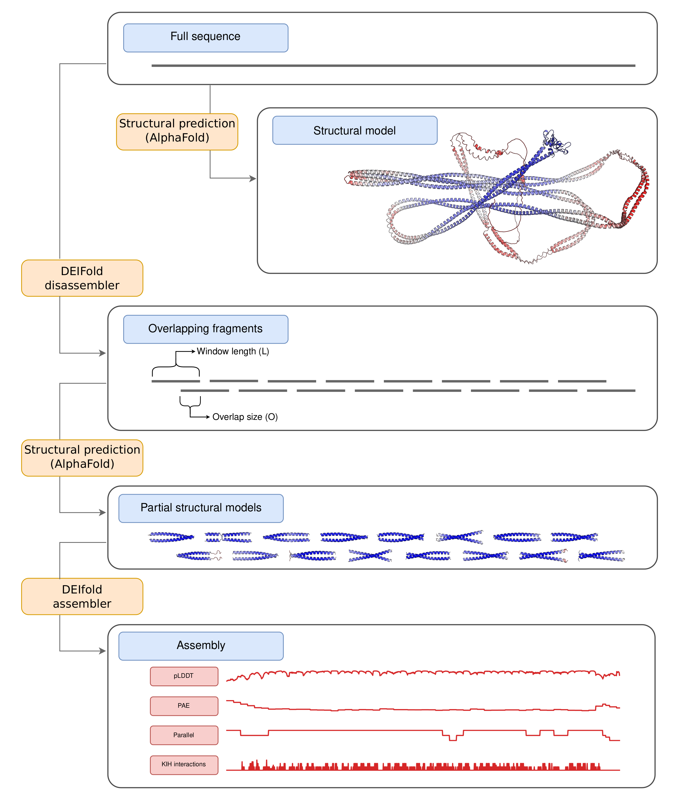
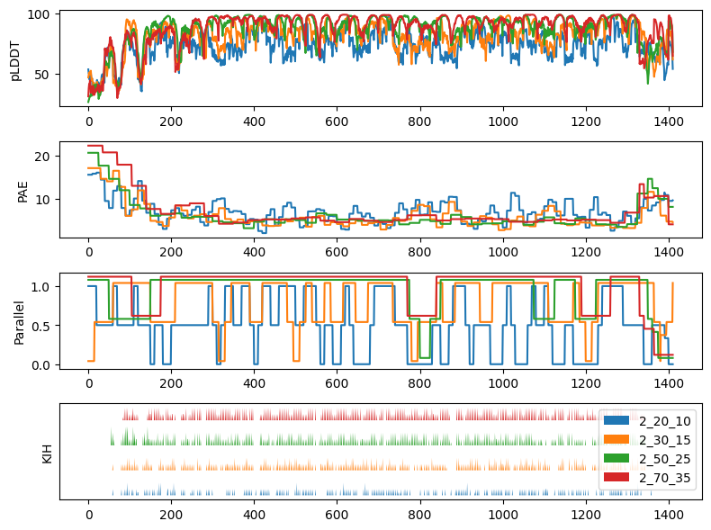
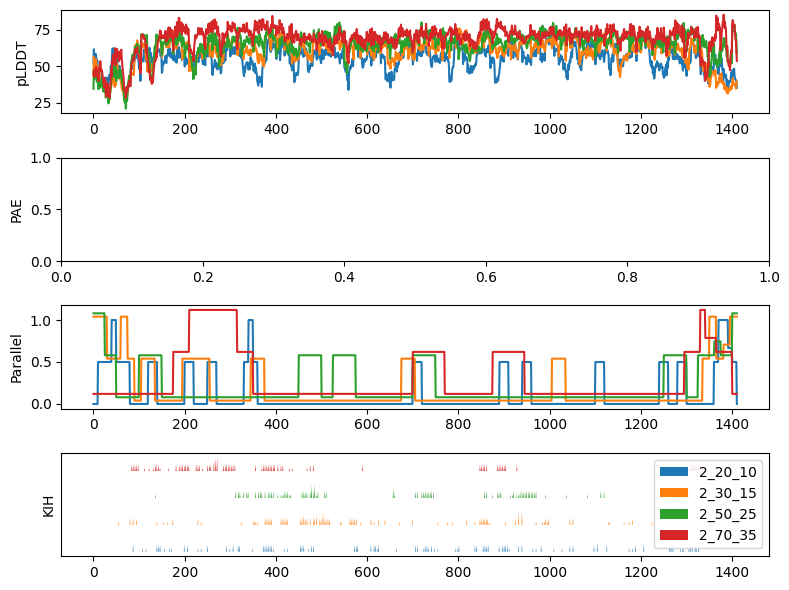

# CCfrag: Scanning folding potential of coiled-coil fragments with AlphaFold

## Summary

This document is under construction!







## Installation

### Dependencies

### Cloning the repository

## Examples

Here are some examples of how CCfrag can be run

```python
#This is python code
print(123)
a = 2
import numpy
```

## Parameters

## References
